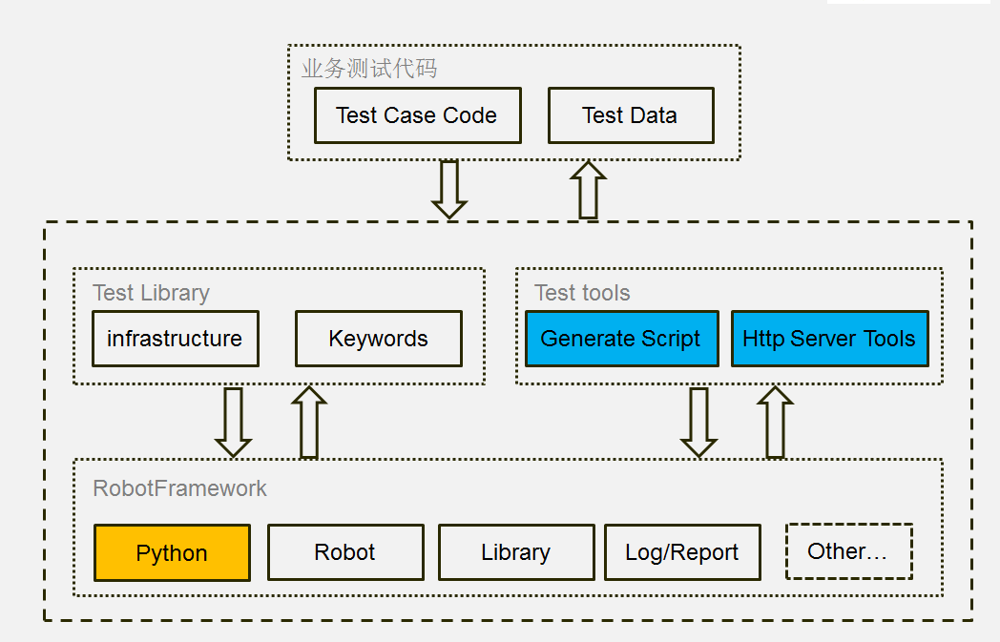

# 接口自动化测试工具框架简图

# 框架设计思路
## 为什么使用RF做接口自动化
1、RF基于python，门坎低，掌握python代码的基本能力后，学习起来几乎没有难度   
2、RF支持模块化关键字、业务逻辑封装，方便代码分层，对多人协作支持良好    
3、RF支持测试套、测试用例的预处理和后处理，方便与单元测试用例相结合     
4、RF支持数据驱动，支持测试数据抽离，支持自然语言来命名关键字     
5、RF代码基于关键字加参数的语法结式，很容易使用脚手架代码来生成基础的自动化测试脚本
## 为什么要写脚手架代码来自动生成RF脚本
1、用来解决要测试的HTTP接口非常多的情况，例如，超过500个接口需要支持            
2、用来解决效率问题，例如，接口参数、接口名称经常变化    
3、用来解决规范化问题，例如，对于底层API通信层的关键字封装，需要统一规范，使用代码生成出来的脚本是最规范的，而且对于用户来说没有任何成本    
4、方便后续扩展，例如，现在RF接口底层用的'REQUEST'python模块，后续如果不满足需求，只需要重写GET/POST几个关键字即可升级整个底层调用    
5、方便分工协作，使工具平台与业务逻辑分离        
## 使用RF完成接口自动化的基本步骤
1、收集接口自动化需求，搭建代码框架，制定统一规范    
2、根据接口文档准备XLS接口定义文件，用来自动生成底层HTTP接口RF关键字脚本及基本验证脚本    
3、根据制定的统一规范，编写示例工程，选择试点项目进行试点    
4、根据试点过程中发现的问题，及时做出调整，扩大工具应用规模，覆盖全部需求用户，此时正试启动接口自动化项目    
5、项目过程中需要收集整理用户需求，在公共关键字平台中实现相应的需求。提交用户需求前，需要在标准用例中验证通过    
6、跟踪自动化过程中的进度和问题，及时总结    